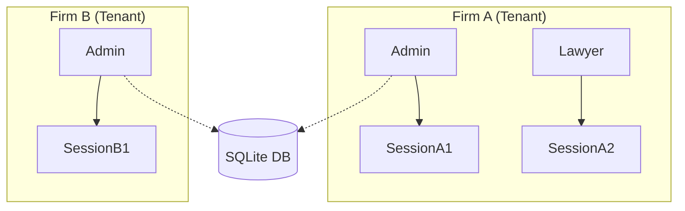

# System Architecture

lexlegalcloud is designed as a **modern monolith** that prioritizes simplicity, type-safety, and interactive user experiences without the complexity of a heavy frontend framework.

## 🏛️ Conceptual Model

The system follows a multi-tenant architecture where data is strictly isolated by **Firm**.

### Entity Hierarchy
1. **Firm**: The top-level container. All data (users, cases, sessions) belongs to a firm.
2. **User**: Belongs to a single firm. Has specific roles (Admin, Lawyer, etc.).
3. **Session**: Tied to a user and validated against their status and firm.

## ⚡ Unified Stack (THE GOTH STACK)

Instead of a separate SPA and API, lexlegalcloud uses the **GOTH stack** to keep logic on the server while providing a reactive UI.

- **Go (Echo)**: Handles all routing, security, and business logic.
- **Templ**: Generates HTML dynamically on the server with full Go type-safety.
- **HTMX**: Bridges the gap by requesting **HTML fragments** instead of JSON, allowing for seamless page updates.
- **Alpine.js**: Manages small client-side behaviors (like modals or toggles) that don't require server interaction.

## 🔄 Request Lifecycle

1. **User Interaction**: A user clicks a button or submits a form.
2. **HTMX Request**: HTMX intercepts the event and sends an AJAX request to the server.
3. **Go Handler**: 
    - Validates Authentication & Permissions.
    - Interacts with the **SQLite** database via **GORM**.
    - Prepares data for the view.
4. **Templ Render**: The handler renders a specific `templ` component or partial.
5. **DOM Update**: HTMX swaps the received HTML fragment into the existing page without a full reload.

## 🛡️ Security & Background Jobs

- **Isolation**: Middleware ensures that users can never access data belonging to another firm.
- **Background Tasks**: The system uses native Go **Goroutines** for non-blocking tasks like sending emails or cleaning up expired sessions/tokens, avoiding the need for external task queues like Redis.

---
*The focus is on a robust, maintainable, and fast system that scales functionally within a single binary.*
